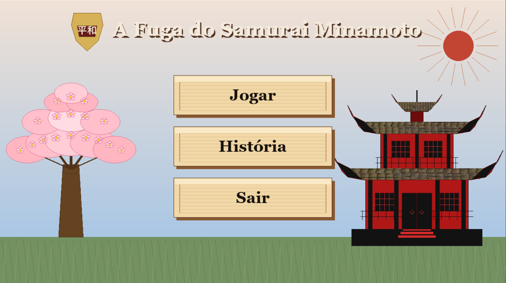
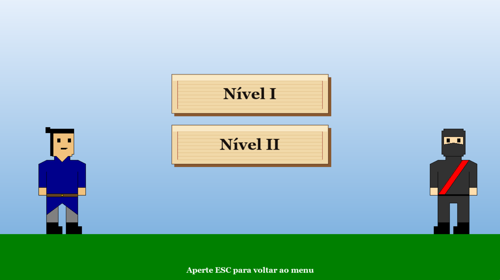
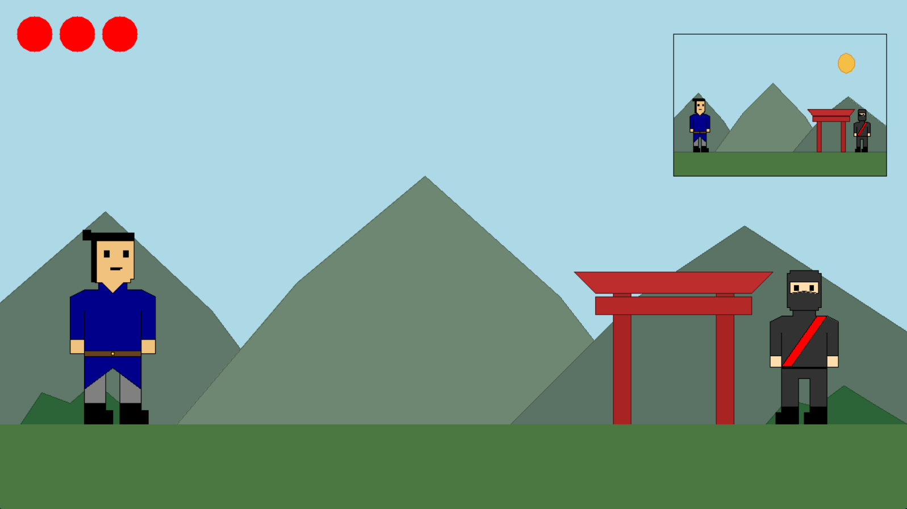

# A Fuga do Samurai Minamoto

# Trabalho 1 - Computação Gráfica

## Descrição
A Fuga do Samurai Minamoto é um jogo 2D desenvolvido em Python utilizando a biblioteca Pygame. O jogador controla um samurai do clã Minamoto que precisa fugir de ninjas enquanto percorre o cenário. O projeto foi desenvolvido com o objetivo de aplicar conceitos estudados na disciplina de Computação Gráfica.

## Conceitos Utilizados
- Set Pixel
- Algoritmo de Bresenham
- Polígonos
- Circunferência e Elipse
- Preenchimento de formas (Scanline Fill e Flood Fill)
- Gradiente
- Textura
- Transformações Geométricas: Translação, Rotação e Escala
- Animação 2D
- Janela e Viewport
- Recorte de Cohen-Sutherland
- Interação via teclado e mouse
- Menu interativo
- Efeitos Sonoros
- Música de Fundo

## Aviso
Não foram utilizadas bibliotecas gráficas para além de funções gráficas que usem o Set Pixel.

## Interação com Menus
Ao iniciar o programa, será exibido ao usuário um menu inicial que dispõe das seguintes opções: Jogar, História e Sair. A tela de História apresenta todo o contexto fictício o qual o jogo se insere. Ao apertar em Sair, o código é fechado. Por fim, ao apertar em Jogar, será exibido um  menu secundário que apresenta duas opções: Nível I e Nível II. Apertando em Esc o usuário volta para o menu principal.

  

  

## Jogabilidade
Ao apertar em Nível I ou em Nível II, irá ser exibido um cenário típico japonês medieval, um samurai e um ninja. O jogador irá controlar o samurai e terá que desviar das investidas do ninja, para isso o usuário deve utilizar os seguintes botões do teclado:

- Seta para direita: Movimenta o samurai para direita
- Seta para esquerda: Movimenta o samurai para esquerda
- Barra de Espaço: Faz o samurai pular

Para o jogador ganhar, basta desviar de todos os avanços do ninja sem perder as três vidas (as vidas são expostas como círculos vermelhos no canto superior esquerdo da tela).
O que diferencia o Nível I do Nível II é que, no Nível II, o ninja é mais rápido.
Além disso, em ambas as fases, há uma viewport que apresenta o samurai, o ninja e o cenário no canto superior direito da tela.

  

## Como compilar e executar
Para executar o programa, é necessário ter instalado o Python 3 e o Pygame.
Feito isso, siga os seguintes passos:
1. 
